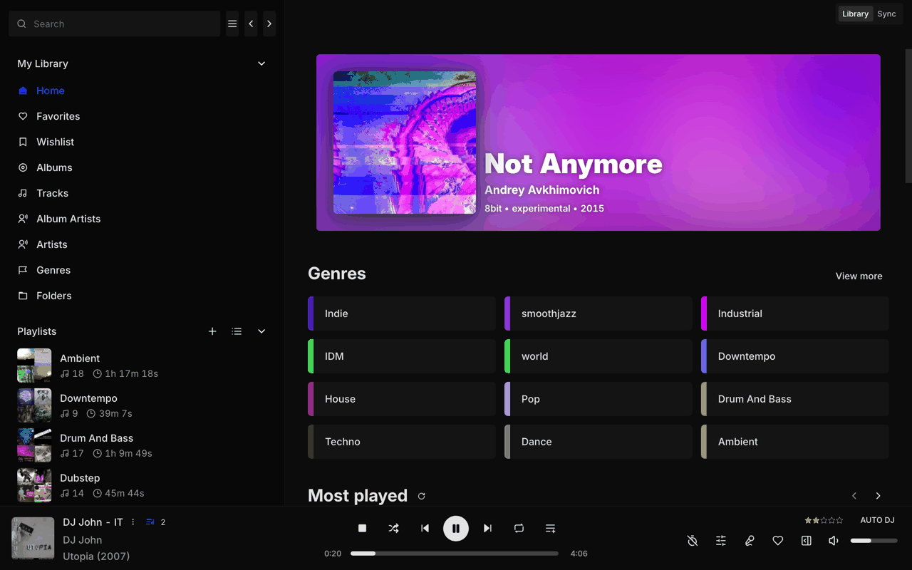

# Subbox

Subbox is a hosted music library and player built for DJs. Your collection lives in the
cloud, and Subbox streams it to any device while keeping it in step with your DJ
software: import from Rekordbox, pull playlists back down as files, keep a wishlist of
tracks you want to add to your crate, and share picks with other people.

  <p align="center">
    <a href="https://github.com/laker-93/subbox-app/blob/development/LICENSE">
      
    </a>
      <a href="https://github.com/laker-93/subbox-app/releases">
      
    </a>
    <a href="https://github.com/laker-93/subbox-app/releases">
      
    </a>
  </p>

---

## Subbox is a hosted service

You don't run Subbox yourself. Sign in at **[www.sub-box.net](https://www.sub-box.net)**
or from the desktop client, and your library, music server and storage are provisioned
for you.

Subbox is currently in **private beta**. On the landing page you can hit **Demo** to
browse a sample collection of licence-free music, or **Request an invite** to get an
account of your own.

This repository contains the **client** only — the Electron desktop app plus the web and
remote-control builds. The backend it talks to (the `pymix` service, together with the
per-user music server and file storage it orchestrates) is a separate, closed service.
There is no self-hosted deployment and no "bring your own server" mode: the client is
built against Subbox's own service URLs, and its features depend on that backend.

## Attribution

Subbox is a fork of [Feishin](https://github.com/jeffvli/feishin), a modern self-hosted
music player by [jeffvli](https://github.com/jeffvli) (itself a rewrite of
[Sonixd](https://github.com/jeffvli/sonixd)). Feishin is licensed under the
GNU General Public License v3.0, and Subbox remains licensed under the GPL-3.0 —
see [LICENSE](LICENSE) and [NOTICE](NOTICE).

Subbox has been modified from the original since 2024 and is not affiliated with or
endorsed by the Feishin project. Please report issues with Subbox to
[this repository](https://github.com/laker-93/subbox-app/issues), **not** to the
Feishin maintainers.

Because upstream is a self-hosted player, parts of the Feishin codebase — server
management, the Jellyfin backend, self-hosting configuration — are inherited but not
used by Subbox, and are not exposed to Subbox users.

## Features

- [x] Cloud library — upload your collection once, then stream it from anywhere
- [x] Rekordbox import — add music to Subbox from a Rekordbox XML export _(desktop)_
- [x] Rekordbox download — pick playlists and get the tracks plus an XML back _(desktop)_
- [x] Watch folder and external-drive import _(desktop)_
- [x] Wishlist — track the records you want, and see when they land in your library
- [x] Sharing — send tracks and playlists to other people
- [x] Auto DJ — keeps the queue topped up so playback never runs dry
- [x] MPV and web player backends
- [x] Smart playlist editor
- [x] Synchronized and unsynchronized lyrics support
- [x] Scrobble playback to your library
- [ ] Serato import/export — supported by the backend, not yet surfaced in the app
- [ ] [Request a feature](https://github.com/laker-93/subbox-app/issues)

## Screenshot

<a href="./src/renderer/assets/landing-library-preview.png"></a>

## Getting Started

### Web

Go to **[www.sub-box.net](https://www.sub-box.net)** — nothing to install. The web app
covers browsing, playback, playlists, the wishlist and sharing.

### Desktop

Download the [latest desktop client](https://github.com/laker-93/subbox-app/releases).
The desktop client is the recommended way to use Subbox: it adds the MPV player backend,
built-in lyrics fetching, and the library-sync flows (Rekordbox upload and download,
watch folders, external drives) that need access to your local filesystem and so cannot
run in the browser.

Sign in with your Subbox account — there is no server to configure.

#### macOS Notes

Builds are not notarized, so macOS will quarantine the app on first launch. Clear it
with:

```sh
xattr -cr /Applications/Subbox.app
```

For media keys to work, you will be prompted to allow Subbox to be a Trusted Accessibility Client. After allowing, you will need to restart Subbox for the privacy settings to take effect.

#### Linux Notes

We provide a small install script to download the latest `.AppImage`, make it executable, and also download the icons required by Desktop Environments. Finally, it generates a `.desktop` file to add Subbox to your Application Launcher.

Simply run the installer like this:

```sh
dir=/your/application/directory
curl 'https://raw.githubusercontent.com/laker-93/subbox-app/refs/heads/development/install-subbox-appimage' | sh -s -- "$dir"
```

The script also has an option to add launch arguments to run Subbox in native Wayland mode. Note that this is experimental in Electron and therefore not officially supported. If you want to use it, run this instead:

```sh
dir=/your/application/directory
curl 'https://raw.githubusercontent.com/laker-93/subbox-app/refs/heads/development/install-subbox-appimage' | sh -s -- "$dir" wayland-native
```

It also provides a simple uninstall routine, removing the downloaded files:

```sh
dir=/your/application/directory
curl 'https://raw.githubusercontent.com/laker-93/subbox-app/refs/heads/development/install-subbox-appimage' | sh -s -- "$dir" remove
```

The entry should show up in your Application Launcher immediately. If it does not, simply log out, wait 10 seconds, and log back in. Your Desktop Environment may alternatively provide a way to reload entries.

### Playback backend (optional)

The desktop client plays through the built-in web backend by default, so it works out of
the box. If you'd rather use MPV, install it from [mpv.io](https://mpv.io/installation/)
(or your package manager), then set the binary path and switch the playback type under
Settings > Playback.

Linux users: the desktop client stores your saved password in `libsecret` by default.
`kwallet4/5/6` are also supported, but must be explicitly set in
Settings > Window > Passwords/secret store.

## FAQ

### Can I self-host Subbox, or point it at my own Navidrome/Jellyfin/Subsonic server?

No. Subbox is a hosted service: the client is built against Subbox's own backend, which
is not distributed. The upstream Feishin project is the option if you want a player you
run yourself against your own server.

### MPV is either not working or is rapidly switching between pause/play states

First thing to do is check that your MPV binary path is correct. Navigate to the settings page and re-set the path and restart the app. If your issue still isn't resolved, try reinstalling MPV. Known working versions include `v0.35.x` and `v0.36.x`. `v0.34.x` is a known broken version. You can also switch the playback type back to the web backend under Settings > Playback.

### I have the issue "The SUID sandbox helper binary was found, but is not configured correctly" on Linux

This happens when you have user (unprivileged) namespaces disabled (`sysctl kernel.unprivileged_userns_clone` returns 0). You can fix this by either enabling unprivileged namespaces, or by making the `chrome-sandbox` Setuid.

```bash
chmod 4755 chrome-sandbox
sudo chown root:root chrome-sandbox
```

Ubuntu 24.04 specifically introduced breaking changes that affect how namespaces work. Please see https://discourse.ubuntu.com/t/ubuntu-24-04-lts-noble-numbat-release-notes/39890#:~:text=security%20improvements%20 for possible fixes.

## Development

Built and tested using Node `v23.11.0`. This project is built off of
[electron-vite](https://github.com/alex8088/electron-vite).

Start with [`CLAUDE.md`](CLAUDE.md) for the invariants (pnpm only, `pnpm lint` before
finishing, `/@/` imports, fork discipline), then
[`docs/ARCHITECTURE.md`](docs/ARCHITECTURE.md) for the process model, the music-server
controller abstraction and the Subbox-specific services.

The service URLs the client is built against live in `.env.development`, `.env.staging`
and `.env.production`, and are baked in at build time — see
[`docs/ENV_SETTINGS.md`](docs/ENV_SETTINGS.md) for the app settings that can additionally
be overridden by environment variable on first run of a web build.

- `pnpm run dev` - Start the development server
- `pnpm run dev:watch` - Start the development server in watch mode (for main / preload HMR)
- `pnpm run start` - Starts the app in production preview mode
- `pnpm run build` - Builds the app for desktop
- `pnpm run build:electron` - Build the electron app (main, preload, and renderer)
- `pnpm run build:remote` - Build the remote app (remote)
- `pnpm run build:web` - Build the standalone web app (renderer)
- `pnpm run package` - Package the project
- `pnpm run package:dev` - Package the project for development locally
- `pnpm run package:linux` - Package the project for Linux locally
- `pnpm run package:mac` - Package the project for Mac locally
- `pnpm run package:win` - Package the project for Windows locally
- `pnpm run publish:linux` - Publish the project for Linux
- `pnpm run publish:linux:beta` - Publish the project for Linux (beta channel)
- `pnpm run publish:linux-arm64` - Publish the project for Linux ARM64
- `pnpm run publish:linux-arm64:beta` - Publish the project for Linux ARM64 (beta channel)
- `pnpm run publish:mac` - Publish the project for Mac
- `pnpm run publish:mac:beta` - Publish the project for Mac (beta channel)
- `pnpm run publish:win` - Publish the project for Windows
- `pnpm run publish:win:beta` - Publish the project for Windows (beta channel)
- `pnpm run typecheck` - Type check the project
- `pnpm run typecheck:node` - Type check the project with tsconfig.node.json
- `pnpm run typecheck:web` - Type check the project with tsconfig.web.json
- `pnpm run lint` - Lint the project
- `pnpm run lint:fix` - Lint the project and fix linting errors
- `pnpm run i18next` - Generate i18n files

The web build is deployed as the public `laker93/player` Docker image, one image per
target environment (the URLs above are baked in at build time). That image exists to run
Subbox's own web front end — on its own it is not a usable install, since it still needs
the hosted backend.

## Translation

Translations live in `src/i18n/locales/`. To contribute one, edit or add a locale file
and open a pull request; run `pnpm i18next` if you have added new strings.

## License

Subbox — Copyright (C) 2024-2026 Luke Purnell
Based on Feishin — Copyright (C) 2022-2024 jeffvli and the Feishin contributors.

This program is free software: you can redistribute it and/or modify it under the
terms of the GNU General Public License as published by the Free Software Foundation,
either version 3 of the License, or (at your option) any later version.

This program is distributed in the hope that it will be useful, but WITHOUT ANY
WARRANTY; without even the implied warranty of MERCHANTABILITY or FITNESS FOR A
PARTICULAR PURPOSE. See the [GNU General Public License](LICENSE) for more details.

The Subbox backend service (`pymix`) is a separate program that communicates with this
client over an HTTP API. It is not covered by this license — see its own repository.

"Subbox" and the Subbox logo are trademarks of Luke Purnell. The GPL grants you rights
to the code, not to the name or branding; forks must be distributed under a different
name and logo.
