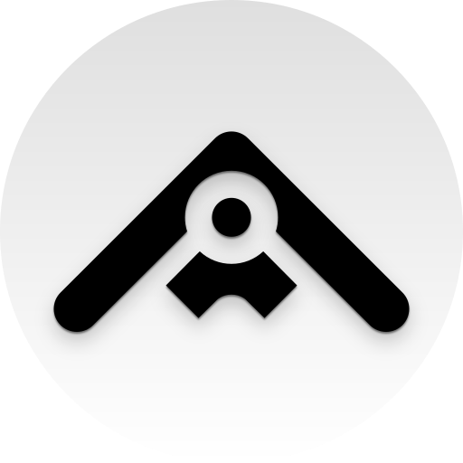

# Subbox

Subbox is a self-hosted music player built for DJs. It connects to your Navidrome,
Jellyfin, or Subsonic-compatible server and adds DJ-focused workflows on top: library
and playlist sync with Rekordbox and Serato, a wishlist for tracks you want to add to
your crate, and sharing tools for sending picks to other people.

It's available as a desktop app (Windows, macOS, Linux) or as a Docker image for
running it as a web app.

## Attribution

Subbox is a fork of [Feishin](https://github.com/jeffvli/feishin), a modern self-hosted
music player by [jeffvli](https://github.com/jeffvli) (itself a rewrite of
[Sonixd](https://github.com/jeffvli/sonixd)). Feishin is licensed under the
GNU General Public License v3.0, and Subbox remains licensed under the GPL-3.0 —
see [LICENSE](LICENSE) and [NOTICE](NOTICE).

Subbox has been modified from the original since 2024 and is not affiliated with or
endorsed by the Feishin project. Please report issues with Subbox to
[this repository](https://github.com/laker-93/subbox-app/issues), **not** to the
Feishin maintainers.

## License

Subbox — Copyright (C) 2024-2026 Luke Purnell
Based on Feishin — Copyright (C) 2022-2024 jeffvli and the Feishin contributors.

This program is free software: you can redistribute it and/or modify it under the
terms of the GNU General Public License as published by the Free Software Foundation,
either version 3 of the License, or (at your option) any later version.

This program is distributed in the hope that it will be useful, but WITHOUT ANY
WARRANTY; without even the implied warranty of MERCHANTABILITY or FITNESS FOR A
PARTICULAR PURPOSE. See the [GNU General Public License](LICENSE) for more details.

The Subbox backend service (`pymix`) is a separate program that communicates with this
client over an HTTP API. It is not covered by this license — see its own repository.

"Subbox" and the Subbox logo are trademarks of Luke Purnell. The GPL grants you rights
to the code, not to the name or branding; forks must be distributed under a different
name and logo.
